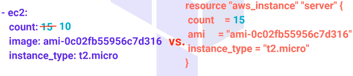
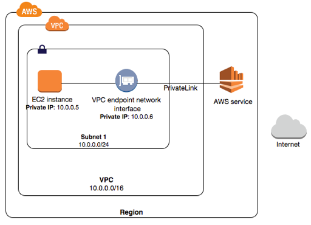

# Apuntes DevOps Bootcamp: Terraform

Created: March 4, 2023 11:10 AM

## Terraform and AWS Introduction

- ¿Por qué Terraform?
    
    Cuando queremos construir la infraestructura de la red de la empresa, tendremos 2 posibilidades: *Cloud* y *On-premise*.
    
    On-premise
    
    Cloud
    
    - Todo se instala localmente, en los servidores de la compañía.
    
    - Todos los recursos de red están completamente gestionados por terceros proveedores.
    
    - Deben adquirir nuevo hardware, licencias y configurar el software para adaptarse a las necesidades y requerimientos.
    
    - Las empresas ya no necesitan adquirir la infraestructura informática por adelantado, pagando solo por los recursos que usen.
    
    - Las empresas pueden poner al instante cientos o miles de servidores en minutos.
    
    Terraform es una herramienta DevOps Open Source Infrastructure as Code (IaC) creada por HashiCorp, que permite a los DevOps Engineers automatizar y gestionar la Data Center infrastructure, las plataformas y los servicios que corren en dichas plataformas.
    
    Permite definir recursos, tanto On-promise como Cloud, configurando archivos legibles que pueden ser leídos y compartidos. 
    
    Nos centraremos en automatización y gestión de la infraestructura de nube.
    
    - Automatización de infraestructuras:
        - Provisioning: Obtener y setear los componentes físicos requeridos para correr aplicaciones específicas.
- Comparación entre algunas herramientas IaC
    
    
    Terraform, CloudFormation
    
    Ansible, Saltstack, Chef, Puppet
    
    Son herramientas de provisionamiento, esto es, están diseñadas para provisionar los servidores de infraestructura, cargar balanceadores, bases de datos, dispositivos de seguridad, etc.
    
    Son herramientas de gestión de configuración, esto es, están diseñadas para instalar y gestionar el software de servidores existentes.
    
    Terraform es declarativo, esto es, describimos el objetivo mas que los pasos necesarios para alcanzarlo (qué hacer)
    
    Ansible es imperativo, esto es, describimos el paso a paso a seguir para lograr el objetivo (cómo hacerlo)
    
    
    
    imperativo con Ansible (azul) vs. declarativo con Terraform (rojo)
    
- Comandos Terraform
    
    ```powershell
    Main commands:
      init          Prepare your working directory for other commands
      validate      Check whether the configuration is valid
      plan          Show changes required by the current configuration
      apply         Create or update infrastructure
    	apply         Create and approve infraestructure automatically
    	-auto-approve 
      destroy       Destroy previously-created infrastructure
    
    All other commands:
      console       Try Terraform expressions at an interactive command prompt
      fmt           Reformat your configuration in the standard style
      force-unlock  Release a stuck lock on the current workspace
      get           Install or upgrade remote Terraform modules
      graph         Generate a Graphviz graph of the steps in an operation
      import        Associate existing infrastructure with a Terraform resource
      login         Obtain and save credentials for a remote host
      logout        Remove locally-stored credentials for a remote host
      output        Show output values from your root module
      providers     Show the providers required for this configuration
      refresh       Update the state to match remote systems
      show          Show the current state or a saved plan
      state         Advanced state management
      taint         Mark a resource instance as not fully functional
      test          Experimental support for module integration testing
      untaint       Remove the 'tainted' state from a resource instance
      version       Show the current Terraform version
      workspace     Workspace management
    
    Global options (use these before the subcommand, if any):
      -chdir=DIR    Switch to a different working directory before executing the
                    given subcommand.
      -help         Show this help output, or the help for a specified subcommand.
      -version      An alias for the "version" subcommand.
    ```
    
- AWS Basic
    
    [Documentación de AWS (amazon.com)](https://docs.aws.amazon.com/index.html)
    
    
    
    AWS es una plataforma integral de computación en la nube que ofrece infraestructura como servicio (IaaS) y plataforma como servicio (PaaS), se compone por:
    
    - Virtual Private Cloud (VPC)
        
        Nos permite lanzar recursos en una red virtual que hayamos creado. Se asemeja a una red tradicional en la que operaremos en nuestro propio centro de datos, pero con los beneficios de usar la infraestructura escalable de AWS.
        
        Al crear una cuenta de AWS, tenemos por default una VPC disponible:
        
        
        
        VPC por default
        
        
        
        Resumen de la VPC por default
        
        Cabe aclarar que es posbile definir nuevas VPC con ciertas configuraciones que deseemos que tengan, al igual que setear nueva información en esta por default.
        
        Es posible también asociar grupos de seguridad, configurar routing y agregar subredes dentro de esta VPC. Cada VPC estará aislada de otras VPC de otros usuarios, pero estas subredes de una VPC podrán comunicarse entre ellas.
        
        Todo dentro de la misma VPC tiene Layer-2 reachability, a pesar de que no hay Layer-2 en VPCs.
        
        En conclusión, luego de haber creado y configurado una VPC, lanzaremos AWS recursos en una específica subred y los protegeremos usando grupos de seguridad y listas de control de acceso a la red, estos son tipos de firewalls en AWS.
        
        Documentación: [¿Qué es Amazon VPC? - Amazon Virtual Private Cloud](https://docs.aws.amazon.com/es_es/vpc/latest/userguide/what-is-amazon-vpc.html)
        
    - Amazon Elastic ComputeCloud (EC2)
        
        Lo usamos para lanzar servidores virtuales, configurar seguridad y redes y administrar almacenamiento. 
        
        EC2 proporciona varias features, entre las cuales se encuentran las ************instancias************ que es un servidor virtual en la nube, plantillas preconfiguradas para estas instancias o **Amazon Machine Images (AMI)**, configuraciones de CPU, memoria, almacenamiento y capacidad de red **(Instance types)**, etc.
        
        
        
        
        
        Documentación: [¿Qué es Amazon EC2? - Amazon Elastic Compute Cloud](https://docs.aws.amazon.com/AWSEC2/latest/WindowsGuide/concepts.html)
        
    - Zonas de disponibilidad y regiones
        
        Ubicaciones físicas de los centros de  datos del cluster.
        Las regiones están separadas. Áreas geográficas y zonas disponibles están aisladas dentro de cada región, de manera que no se vean afectadas por otras.
        
        
        
- Estructura de código Terraform
    
    El flujo de trabajo en Terraform está compuesto por 3 etapas: *Escritura de la configuración, Planeación o previsualización de los cambios antes de aplicarlos y Aplicación para provisionar la infraestructura.*
    
    - *Terraform modules:* Un módulo Terraform es un directorio que contiene uno o más archivos de configuración con extensión ***.tf***
    
    
    
    - *Terraform providers:* Para trabajar en Terraform requerimos un proveedor como AWS, Azure, GPC, etc. Sin este, no podemos gestionar nada.
    Los providers son plugins que Terraform usa para crear y administrar recursos en una infraestructura específica. Estos proporcionan recursos para gestionar una single cloud o plataforma de infraestructura. Un provider puede verse como una librería en un lenguaje de programación.
    Lista de providers: [Browse Providers | Terraform Registry](https://registry.terraform.io/browse/providers)
    
    Vamos a trabajar con AWS provider, así que vamos a la documentación de este: [Docs overview | hashicorp/aws | Terraform Registry](https://registry.terraform.io/providers/hashicorp/aws/latest/docs)
    
    En el archivo *******[main.tf](http://main.tf)* agregamos:
    
    ```jsx
    terraform {
      required_providers {
        aws = {
          source  = "hashicorp/aws"
          version = "~> 4.0"
        }
      }
    }
    
    # Configure the AWS Provider
    provider "aws" {
      region = "us-east-1"
    }
    ```
    
- Sintaxis de configuración Terraform
    
    Las configuraciones de Terraform puede escribirse usando ya sea lenguaje nativo Terraform o formato compatible JSON. Las extensiones para estos archivos serían ******.tf****** y ***************************.tf.json,*************************** respectivamente.
    El uso de ambas formas son llamados *Hashicorp Configuration Language (HCL)*
    La sintaxis de configuración Terraform está compuesta por dos elementos: bloques y argumentos.
    
    Cada bloque tiene un tipo, por ejemplo, *********provider********* y *******resource,******* luego de este tipo, hay una etiqueta, por ejemplo, *******************“aws”, “aws_vpc”, “aws_main_vpc”.*******************  Pueden haber también bloques que no poseen etiquetas.
    Dentro de cada bloque, podemos encontrar argumentos y sus valores luego del igual. Estos pueden contener también letras, dígitos, guiones y guiones bajos.
    Los comentarios de una sola línea se realizan con el símbolo *******************#******************* (predeterminado) o también con *//*. Si hay más de una línea, se usa *******************/* */*******************
    
    
    
- Inicializando directorios de trabajo
    
    Desde la terminal, nos dirijimos al directorio donde se encuentra el archivo ***main.tf*** y hacemos ***terraform.init***. Este comando inicializa un nuevo o existente directorio de trabajo, creando archivos iniciales, cargando cualquier estado remoto, descargando módulos, etc. 
    Es el primer comando que debemos correr para cualquier nueva o existente configuración. Esto configura toda la data local necesaria para correr Terraform.
    
    
    
    Obtendremos los siguientes archivos nuevos:
    
    
    
    El archivo ********************.terraform.lock.hcl******************** contiene la información de la creación y actualización cada vez que se corre terraform init. Muestra la información de todos los providers que usemos y el correcto versionado, en caso tal de compartir la información. El otro directorio nuevo, es un caché local donde Terraform almacena algunos archivos necesarios para operaciones subsecuentes con la misma configuración.
    
    ```jsx
    # This file is maintained automatically by "terraform init".
    # Manual edits may be lost in future updates.
    
    provider "registry.terraform.io/hashicorp/aws" {
      version     = "4.57.1"
      constraints = "~> 4.0"
      hashes = [
        "h1:qIwRZ8raS3uMsGpmFKHJzTvCJ3kAOB02tyP4tHQJ328=",
        "zh:44200c213ddb138df80d2a5ad86c2ebadbb5fd1d08cd7e4fc56ec6dca927659b",
        "zh:469e6fe6a9e99e60cb168d32f05e2e9a83cf161f39160d075ff96f7674c510e1",
        "zh:6110ba2c15a2268652ec9ea3797dd0216de84ece428055c49eaf9caa2be1ed62",
        "zh:62ed7348acca44f64fc087e879e01cfa4e084c7600cc91e8bb7683f8065a9c79",
        "zh:7a80e6fa9b35be178bb566093f7984dd6ffb7ad9d40b9dd5d5907f054f0c3e60",
        "zh:8793043c8575a598c1a7cbefcb65ee1776b0061eba719098e552a3adc88f3090",
        "zh:9b12af85486a96aedd8d7984b0ff811a4b42e3d88dad1a3fb4c0b580d04fa425",
        "zh:a777a0082114e273b7b3eb14095a3f6f6e703c1aff61ffb1f0846bb869e6dfc7",
        "zh:b060c3b2973097f2087a98ac6aad7c9c89fe80f7cf3027019049feafc3f8305b",
        "zh:e7035e74563f4486848ea1feb60852175353790bc374e0e97e241a88dc0908f7",
        "zh:eaaa8e9eba09ada41e13116d53d4baece04fead8fcf3eab68cca3a67ed738e18",
        "zh:ec52d8f95a84fad8fe1aae169c89d0c54d5401f75caae0869ad8182c6b6db65b",
        "zh:f0e33174025b1b57ecfbdd09f2a59c2559ee94d7681e5ae09079e2822ec54ecf",
        "zh:f69790a21380e5aab9303a252564737333e1e95b5d25567681630e49b17e3ec7",
        "zh:ff6053942c40a99904bd407f3c082c1fa8f927ecce0374566eb7e8ee8145e582",
      ]
    }
    ```
    
- Autenticación con AWS
    
    Agregamos las credenciales de nuestra cuenta de AWS:
    
    ```jsx
    terraform {
      required_providers {
        aws = {
          source  = "hashicorp/aws"
          version = "~> 4.0"
        }
      }
    }
    
    # Configure the AWS Provider
    provider "aws" {
      region = "eu-central-1"
      access_key = AWS_ACCESS_KEY_ID
      secret_key = AWS_SECRET_ACCESS_KEY_ID
    }
    ```
    
    Podemos usar también las variables de entorno para guardar allí las credenciales.
    
- Creación de recursos
    
    Dentro de la documentación de AWS Provider,buscamos el recursos que queremos utilizar. En este ejemplo, buscamos VPC y luego *******aws_vpc******* dado que es el recurso que proporciona una VPC:
    
    
    
    La sintaxis general para traer un recurso será:
    
    ```jsx
    resource "<provider>_<resource_type>" "local_name" {
      argument1 = value1
      argument2 = value2
    	...
    }
    ```
    
    - **Ejemplo:**
        
        
        
        
        
        
        
        
        
        ***resource*** declara un recurso de un tipo de recurso dado (***************Resource Type***************) y un nombre local (****************Reference name****************). El nombre es usado para referenciar el recurso de algún lugar en el mismo módulo Terraform, pero no tiene significancia fuera del alcance de este. 
        ⚠️ ¡Estos nombres deben ser únicos dentro del módulo!
        Dentro de las llaves ubicamos los argumentos de configuración y los valores de estos.
        Podemos agregar, también, *tags* con pares clave-valor.
        
    
    En el caso de crear una VPC con una reservada de subred CIDR y una etiqueta para nombrar la VPC , se vería así:
    
    ```jsx
    resource "aws_vpc" "main" {
      cidr_block = "10.0.0.0/16"
      tags = {
        "Name" = "Main VPC"
      }
    }
    ```
    
    Podemos tener más opciones de configuración las cuales son opcionales (ver [Documentación](https://registry.terraform.io/providers/hashicorp/aws/latest/docs/resources/vpc))
    
    Cada recurso está asociado con un único tipo de recurso el cual determina el tipo de objeto de infraestructura que administra y qué argumentos, atributos, soporta.
    
- Plan & Apply
    
    Crearemos el plan para los cambios antes de aplicarlos y aplicaremos la provisión a la infraestructura. Desde la terminal donde está el archivo *********main.tf********* ejecutamos el comando ***terraform plan***
    
    
    
    Esto revisará el cada estado actual de los objetos remotos para verificar que se encuentran al día. Compara la configuración anterior con la nueva y notifica las diferencias. Si hay alguna, Terraform propone un conjunto de acciones que deberán hacer a los objetos remotos matchear conla configuración actual.
    ⚠️ No realiza cambios, solo muestra las novedades.
    
    Los recursos que serán creados, así como los argumentos y etiquetas, están indicados con el signo ➕ en verde. El argumento ***********cidr_block*********** es el único especificado con un valor concreto, sin embargo, hay otros argumentos cargados por default. Estos valores existirán solo después de realizar un *apply*.
    
    Si deseamos guardar este plan, usamos el comando ****************************terraform plan -out=tfplan.**************************** No es necesario que sea ******tfplan****** pero por convención usamos la palabra “plan” al final. Después de esto, obtendremos en la terminal:
    
    
    
    Se generará un archivo en el directorio con el plan:
    
    
    
    Para aplicar el plan, usamos ************************************************terraform apply************************************************ e ingresamos ****yes:****
    
    
    
    Verificamos en VPC Dashboard que se haya registrado correctamente nuestro VPC:
    
    
    
    Si volvemos a correr el comando ******************************************terraform plan******************************************, obtenemos:
    
    
    
    Cuando se crea el VPC, también se crean con este los distintos elementos que lo componen: ********************Tabla de enrutamento principal, ACL de red principal, CIDR,******************** etc.
    
    
    
    ⚠️ Si eliminamos la VPC y volvemos a ejecutar los comandos de *****terraform plan***** y *terraform apply,* obtenemos de nuevo la creación del VPC.
    
- Formateo y validación de archivos de configuración
    
    Terraform posee un comando que permite la reescritura de los archivos de configuración, de manera que estos sean más legibles y consistentes. Este comando es ***terraform fmt.*** Igualmente, podemos seguir ciertas convenciones de nombrado y así tener un código más prolijo:
    
    - Usamos _ (guión bajo) en lugar de - ( guión) en todo lugar.
    - Usamos letras en minúscula y números preferiblemente.
    - No repetimos el tipo de recurso en el nombre del recurso.
    
    ```jsx
    ✅ resource "aws_router_table" "public" {}
    ❌ resource "aws_router_table" "public_route_table" {}
    ```
    
    Por otro lado, ******************************************terraform fmt****************************************** posee varias opciones:
    
    - ***************************************************************terraform fmt -diff:*************************************************************** Nos mostrará las diferencias de cambio de formato en la consola, antes de reescribir el archivo.
    - ******************************************terraform fmt -diff -check :****************************************** Nos mostrará los cambios pero sin sobreescribir el archivo con estos.
    - ***************************************************************************terraform fmt -recursive:*************************************************************************** Usamos este comando para reformatear todos los archivos en un subdirectorio en particular.
    
    Terraform posee el comando ***terraform validate*** que permite validar la sintaxis y los argumentos de los archivos de configuración en un directorio, mostrando estos errores en la consola:
    
    ```jsx
    Terraform course\01-aws> terraform validate
    ╷
    │ Error: Unsupported argument
    │
    │   on main.tf line 13, in provider "aws":
    │   13:   access_keys = AWS_ACCESS_KEY_ID
    │
    │ An argument named "access_keys" is not expected here.  
    │ Did you mean "access_key"?
    ╷
    │ Error: Invalid block definition
    │
    │   on main.tf line 17:
    │   17: resource "aws_vpc" "main"
    │   18:   cidr_block = "10.0.0.0/16"
    │
    │ A block definition must have block content delimited   
    │ by "{" and "}", starting on the same line as the block 
    │ header.
    ╵
    ```
    
    Si no hay dificultades de sintaxis retornará en la consola:
    
    ```jsx
    Terraform course\01-aws> terraform validate
    Success! The configuration is valid.
    ```
    
- Destrucción de la infraestructura con Terraform
    
    Así como Terraform tiene la capacidad de construir y modificar recursos, también puede destruir y recrearlos. Una vez no tengamos necesidad de seguir usando una infraestructura, podemos querer destruirla para reducir riesgos y costos. 
    
    Existen dos formas de destruir infraestructuras:
    
    - Usando el comando ******************************************************terraform destroy:******************************************************  Es importante tener en cuenta que este comando no puede ser revertido, por lo que es esencial asegurarse de que se desea eliminar permanentemente la infraestructura creada antes de ingresar "*yes*" para confirmar la eliminación. La información a eliminarse se representa con el símbolo ➖ :
    
    ```jsx
    Terraform course\01-aws> terraform destroy
    aws_vpc.main: Refreshing state... [id=vpc-01d94577ea89b3b95]
    
    Terraform used the selected providers to generate the
    following execution plan. Resource actions are indicated
    with the following symbols:
      - destroy
    
    Terraform will perform the following actions:
    
      # aws_vpc.main will be destroyed
      - resource "aws_vpc" "main" {
          - arn                                  = "arn:aws:ec2:eu-central-1:056608321185:vpc/vpc-01d94577ea89b3b95" -> null
          - assign_generated_ipv6_cidr_block     = false -> null
          - cidr_block                           = "10.0.0.0/16" -> null
          - default_network_acl_id               = "acl-05dc898937d442425" -> null
          - default_route_table_id               = "rtb-055346a06df2c00db" -> null
          - default_security_group_id            = "sg-08745a17dcfa07f22" -> null
          - dhcp_options_id                      = "dopt-07baff51886019ae0" -> null
          - enable_classiclink                   = false -> null
          - enable_classiclink_dns_support       = false -> null
          - enable_dns_hostnames                 = false -> null
          - enable_dns_support                   = true -> null
          - enable_network_address_usage_metrics = false -> null
          - id                                   = "vpc-01d94577ea89b3b95" -> null
          - instance_tenancy                     = "default" -> null
          - ipv6_netmask_length                  = 0 -> null 
          - main_route_table_id                  = "rtb-055346a06df2c00db" -> null
          - owner_id                             = "056608321185" -> null
          - tags                                 = {
              - "Name" = "Main VPC"
            } -> null
          - tags_all                             = {
              - "Name" = "Main VPC"
            } -> null
        }
    
    Plan: 0 to add, 0 to change, 1 to destroy.
    
    Do you really want to destroy all resources?
      Terraform will destroy all your managed infrastructure, as shown above.
      There is no undo. Only 'yes' will be accepted to confirm.
    
      Enter a value:
    ```
    
    Una vez ingresado “****yes“****  hará la eliminación de la infraestructura. Veremos por consola al finalizar:
    
    ```jsx
    Enter a value: yes
    
    aws_vpc.main: Destroying... [id=vpc-01d94577ea89b3b95]
    aws_vpc.main: Destruction complete after 1s
    
    Destroy complete! Resources: 1 destroyed.
    ```
    
    Verificamos en nuestra cuenta de AWS que ya no está la VPC:
    
    
    
    Supongamos que tenemos dos recursos creados en el mismo módulo:
    
    ```jsx
    # Configure the AWS Provider
    provider "aws" {
      region     = "eu-central-1"
      access_key = AWS_ACCESS_KEY_ID
      secret_key = AWS_SECRET_ACCESS_KEY_ID
    }
    
    resource "aws_vpc" "main" {
      cidr_block = "10.0.0.0/16"
      tags = {
        "Name" = "Main VPC"
      }
    }
    
    resource "aws_vpc" "myvpc" {
      cidr_block = "192.168.0.0/16"
      tags = {
        "Name" = "My VPC"
      }
    }
    ```
    
    Esto proporcionaría la siguiente vista:
    
    
    
    Si **********SOLO********** queremos eliminar uno de estos recursos, por ejemplo “******myvpc”,****** utilizamos ********el siguiente comando, teniendo presente el tipo de recurso y el nombre de este:
    
    ```jsx
    terraform destroy -target aws_vpc.myvpc -auto-approve
    ```
    
    Obtenemos así, la eliminación:
    
    
    
    ⚠️ Esta opción no es rutinaria: su uso está destinado a situaciones excepcionales como recuperarse de errores o si es sugerido por Terraform para usarse.
    
    - Removiendo los recursos desde la configuración y luego corriendo el comando *********************************************terraform apply*********************************************: Eliminamos las líneas de código del recurso normalmente y usamos el comando para aplicar los cambios.
    
    ✅ Es preferible usar este último método para conservar la consistencia de la infraestructura.
